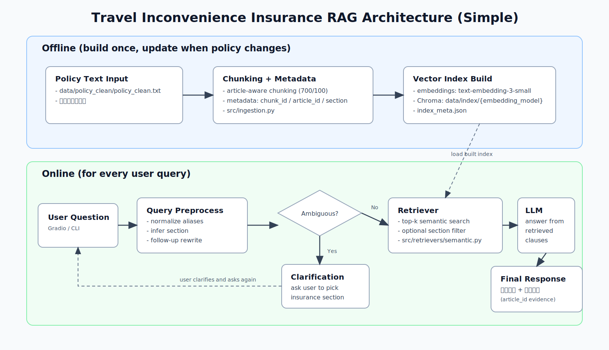
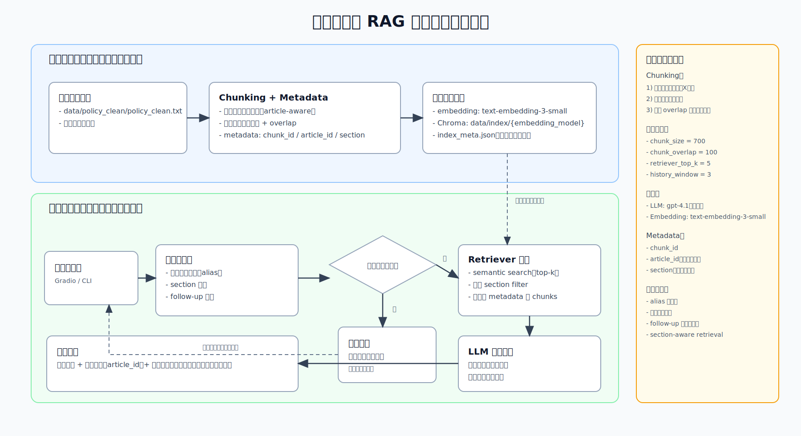
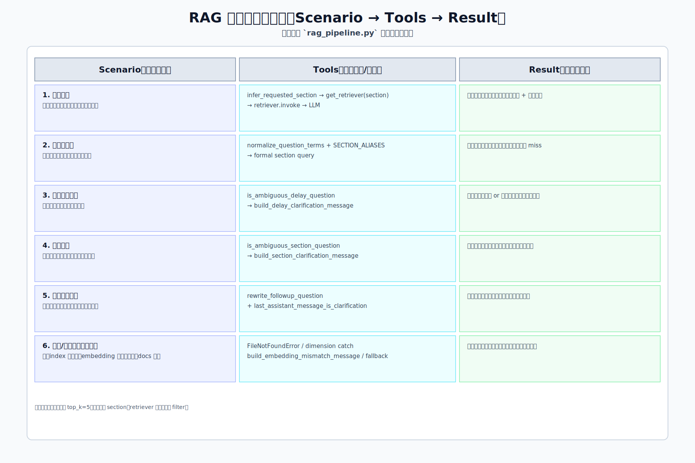
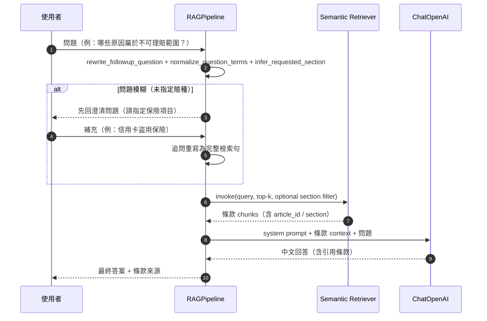

# 旅遊不便險 RAG Chatbot 簡報素材

此文件可直接作為簡報內容骨架，涵蓋：
- 架構圖（從資料檢索到回覆）
- 資料與檢索設計（chunking / metadata / retrieval / prompt）
- 測試 QA 範例
- 目前限制與可行改進方向




## 第二頁文字註解（可直接貼簡報）

### 系統核心策略
- 架構分成兩段：`離線建置`（切塊與建索引）+ `線上問答`（檢索與生成）。
- 回答前先做查詢前處理：`alias 正規化`、`section 推斷`、`follow-up 重寫`。
- 若問題模糊，先澄清再檢索，避免錯答不同險種條款。

### Chunking 與參數（目前實作）
- 策略 1：先用條文標題（`第X條...`）做 article-aware 切分。
- 策略 2：若單條文過長，改為逐行子切分，不直接硬切字元。
- 策略 3：子切分保留尾端 overlap，降低條件句被切斷風險。
- 預設參數：`chunk_size=700`、`chunk_overlap=100`。

### 檢索與模型設定（目前實作）
- Retriever：Chroma semantic search，`top_k=5`。
- Section-aware retrieval：若可推斷險種，套 `filter={"section": ...}`。
- 預設模型：`LLM=gpt-4.1`、`Embedding=text-embedding-3-small`。
- 多輪上下文：`history_window=3`。

### Metadata 設計（每個 chunk）
- `chunk_id`：追蹤 chunk。
- `article_id`：回答引用條款來源。
- `section`：檢索時做險種過濾。

## 工具組合情境表（可直接做一頁）



### Scenario 1：問題明確（直接回答）
- 例：`班機延誤保險有哪些不保事項？`
- 工具組合：`infer_requested_section` -> `get_retriever(section=...)` -> `retriever.invoke` -> `LLM`
- 結果：直接檢索該險種條款並生成有引用回答。

### Scenario 2：口語同義詞（先正規化）
- 例：`信用卡盜刷有哪些不能賠？`
- 工具組合：`normalize_question_terms` + `SECTION_ALIASES` -> semantic retrieval
- 結果：把口語詞轉為正式險種名稱，提升命中率。

### Scenario 3：延誤類型不明（先澄清）
- 例：`旅遊延誤賠償怎麼算？`
- 工具組合：`is_ambiguous_delay_question` -> `build_delay_clarification_message`
- 結果：先詢問「班機延誤」或「行李延誤」，暫不檢索。

### Scenario 4：險種不明（先澄清）
- 例：`哪些原因屬於不可理賠範圍？`
- 工具組合：`is_ambiguous_section_question` -> `build_section_clarification_message`
- 結果：先請使用者指定保險項目，避免跨險種誤答。

### Scenario 5：澄清後短回覆（追問重寫）
- 例：使用者只回 `信用卡盜用保險`
- 工具組合：`rewrite_followup_question` + `last_assistant_message_is_clarification`
- 結果：重寫成完整查詢句後再檢索。

### Scenario 6：索引或模型錯誤（容錯）
- 工具組合：`FileNotFoundError` catch + `build_embedding_mismatch_message`
- 結果：回傳可操作錯誤提示（例如先重建索引），不讓程式直接中斷。

### Scenario 7：檢索不到內容（保守回覆）
- 工具組合：`retriever.invoke` -> `if not docs` fallback
- 結果：回覆「目前找不到相符條款」，避免幻覺式回答。

## 對話控制 Scenario 詳解（兩頁 PNG，可直接放 PPT）


### 第一頁（Scenario 1-3）
- Scenario 1 問題明確：使用者直接點名險種，走 `infer_requested_section` + `get_retriever(section)` 直接檢索並回答。
- Scenario 2 口語同義詞：先經過 `normalize_question_terms` + `SECTION_ALIASES`，再做 section 推斷與檢索。
- Scenario 3 延誤類型不明：`if not section and is_ambiguous_delay_question`，先 `build_delay_clarification_message`。

### 第二頁（Scenario 4-6）
- Scenario 4 險種不明：`if not section and is_ambiguous_section_question`，先 `build_section_clarification_message`。
- Scenario 5 澄清後短回覆：`rewrite_followup_question` + `last_assistant_message_is_clarification`，把短回覆改寫成完整檢索句。
- Scenario 6 容錯與 fallback：處理 `FileNotFoundError`、embedding 維度不一致，以及 `if not docs` 的保守回覆。

### 產圖指令（可重跑）
- `python3 src/generate_dialog_control_scenario_slides.py`

---

## 1) 專案目標

根據「旅遊不便險條款」建立一個簡單 RAG Chatbot 原型，達成：
- 能準確檢索對應條款
- 能輸出具來源（條款編號）的回答
- 能處理常見模糊問句與追問（multi-turn）

---

## 2) 系統總覽架構圖（Offline + Online）

```mermaid
flowchart LR
    subgraph Offline["Offline: 資料處理與索引建置"]
        A[旅遊不便險條款文字檔<br/>data/policy_clean/policy_clean.txt]
        B[Article-aware Chunking<br/>src/ingestion.py]
        C[Chunk Metadata<br/>chunk_id / article_id / section]
        D[OpenAI Embeddings<br/>text-embedding-3-small or large]
        E[Chroma Vector Index<br/>data/index/{embedding_model}]
        F[index_meta.json<br/>embedding_model/chunk_size/overlap/chunk_count]
        A --> B --> C --> D --> E
        E --> F
    end

    subgraph Online["Online: 問答流程"]
        U[使用者問題]
        P[查詢前處理<br/>follow-up 重寫 / 同義詞正規化 / section 推斷]
        Q{是否模糊?}
        C1[回覆澄清問題<br/>請使用者指定險種]
        R[Retriever<br/>Top-k semantic search + section filter]
        S[Context 組裝<br/>附 article_id]
        T[LLM 生成回答<br/>僅依據檢索條款]
        O[最終回覆<br/>回答 + 條款引用]
        U --> P --> Q
        Q -- 是 --> C1 --> U
        Q -- 否 --> R --> S --> T --> O
    end

    E -. 提供檢索索引 .-> R
```

---

## 3) 線上問答流程圖（含澄清與追問）



---

## 4) 資料與檢索設計重點

### Chunking 設計
- 以條文標題（`第X條 ...`）為主切分（article-aware），避免跨條款混雜。
- 預設參數：`chunk_size=700`, `overlap=100`。
- 過長條文再做行級子切分，保留 overlap 以降低邊界資訊遺失。

### Metadata 設計
- `chunk_id`: 追蹤 chunk。
- `article_id`: 供回答引用條款編號。
- `section`: 供 section-aware retrieval 過濾。

### Retrieval 方法
- 向量檢索：Chroma + OpenAI Embeddings。
- `top_k=5`。
- 若問題可推斷險種，套用 `filter={"section": ...}` 降低跨險種誤檢索。
- 索引按 embedding model 分目錄，避免維度不一致問題。

### Prompt 設計重點
- 系統角色：保險條款解釋助手。
- 嚴格限制：只能根據檢索到的條款回答，缺資訊時明確說「條款未明確規範」。
- 回答格式：清楚中文說明 + 最後列出引用條款編號與關鍵內容。

---

## 5) 範例 QA（簡報可直接放）

### Q1: 什麼情況下可以申請旅遊延誤賠償？
- 系統先澄清：「班機延誤」或「行李延誤」。
- 使用者指定後，回覆承保條件與延誤計算方式。
- 來源示例：`第三十條、第三十一條`。

### Q2: 行李遺失後應該如何申請理賠？
- 回答理賠文件與處理流程（理賠申請書、警方報案證明、運輸業者事故證明）。
- 來源示例：`第四十二條、第四十三條`。

### Q3: 哪些原因屬於不可理賠範圍？
- 先要求指定險種（避免回答過度泛化）。
- 指定後輸出對應「特別不保事項」。
- 來源示例：信用卡盜用為 `第五十八條`。

### QA 截圖模板（可直接貼 Gradio 回答）


### 參數比較模板（k / history / chunk）


### 同題不同參數四宮格模板


### 單題參數比較模板（Q1 / Q2 / Q3）


### 建議測試順序（先小範圍 A/B）
- Baseline：`k=5`、`chunk=700/100`、`history=3`。
- 先測 `k`：只改 `k=3`、`k=8`，其餘固定 baseline。
- 再測 `history_window`：`1` 與 `5`。
- 若還要做 chunk 比較，再測：`500/100` 與 `900/120`。
- 每次只改一個參數，問題固定使用 Q1 / Q2 / Q3，方便橫向比較。

---

## 6) 已有評估與結論（可做一頁結果）

- 目前有 `6` 種模型組合 × `3` 種 chunk 設定，共 `18` 組測試。
- 測試包含：模糊問句、追問重寫、同義詞映射、例外條件題。
- 現階段推薦預設：
  - `gpt-4.1 + text-embedding-3-small + chunk_size=700 + overlap=100`
- 成本導向可用：
  - `gpt-4o-mini + text-embedding-3-small + 700/100`

---

## 7) 目前限制與可行改進方向（具體）

### 限制 A：語料仍是單一條款文件
- 風險：未來多商品/多版本時容易混淆。
- 改進：新增 metadata（`product_id`, `policy_version`, `effective_date`），檢索前先做版本過濾。

### 限制 B：引用為條款級，尚未做句級驗證
- 風險：回答可能部分超出證據細節。
- 改進：加入 answer verifier，檢查每句回答是否可由檢索片段支持。

### 限制 C：同義詞映射多為規則表維護
- 風險：遇到新口語時 recall 下降。
- 改進：加入 query rewrite/classifier，並用使用者 query log 持續擴充 alias。

### 限制 D：檢索仍以 semantic 為主
- 風險：特定關鍵字條款可能漏召回。
- 改進：導入 hybrid retrieval（BM25 + Vector）與 reranker 提升 precision/recall。

---

## 8) 與程式碼對應（Demo 時可指）

- `src/ingestion.py`: 條款切分、metadata、索引建置
- `src/retrievers/semantic.py`: Chroma 檢索與 section filter
- `src/rag_pipeline.py`: 模糊題澄清、follow-up 重寫、答案生成
- `src/gradio_app.py`: Chat UI
- `data/evals/model_chunk_eval_v2_20260305_005102.md`: 情境評估結果
